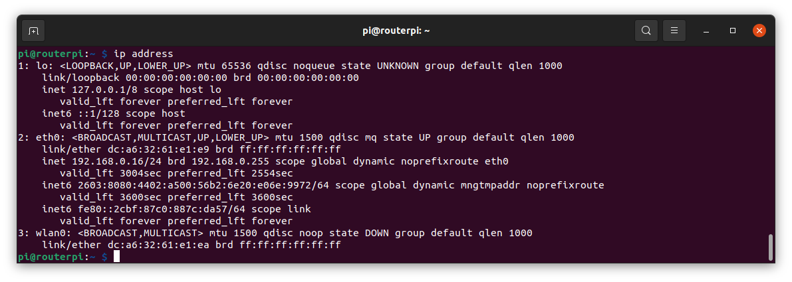
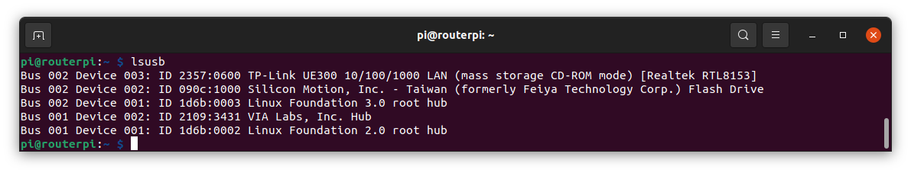
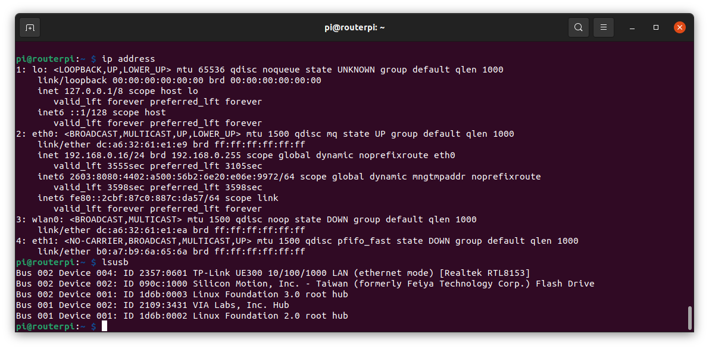

# Ethernet Dongle
I used the TP-Link USB3.0 to Gigabit Adapter

#
## USB mode issue
However, when used with a RapsberryPi4, eth1 is not seen at reboot

LSUSB shows the device comes up in CD-ROM mode

## USB_MODESWITCH solution
Add the below file which at bootup resets the dongle with the "usb-modeswitch" utility
#
    sudo nano /etc/udev/rules.d/98-tplinku300.rules
#
```
ACTION=="add", SUBSYSTEM=="usb", ENV{ID_VENDOR_ID}=="2357", ENV{ID_MODEL_ID}=="0600", RUN+="/usr/sbin/usb_modeswitch -v 2357 -p 0600 -Q -R"
```
#
    sudo reboot
Success!  We can now see eth1 and also that the adapter is in ethernet mode
