# Install Raspberry PI OS image 
on Raspberry Pi 

## &nbsp;

Follow [Getting Started](https://www.raspberrypi.com/documentation/computers/getting-started.html) instructions on official raspberrypi.com website

Strongly recommend using the Raspberry PI Imager and selecting
"Raspberry Pi OS Lite (32-bit)"

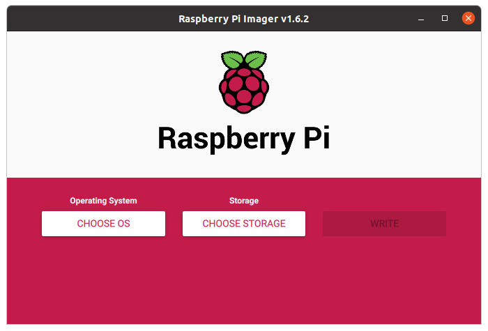

select "Raspberry Pi OS (other)"

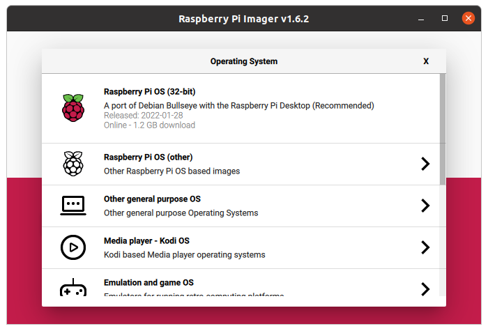

select "Raspberry Pi OS Lite (32-bit)"

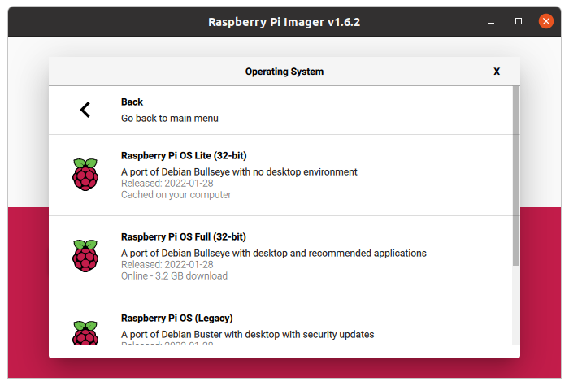

    
## Launch Raspi-Config
from raspberry pi terminal
#
    pi@raspberrypi:~$ sudo raspi-config
   

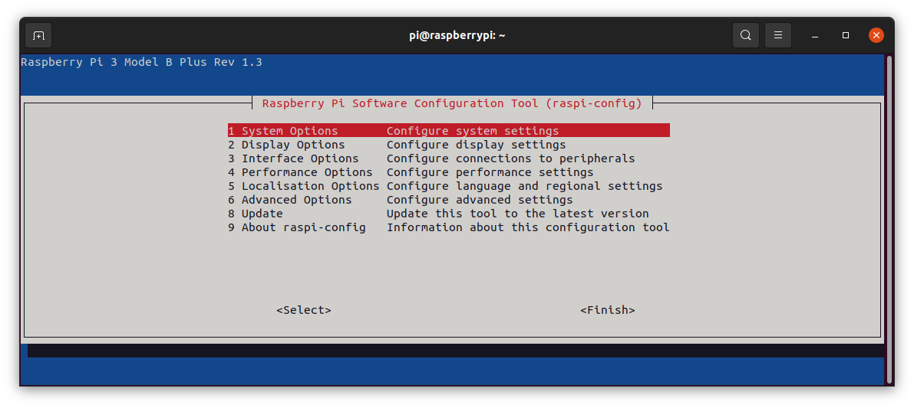

## System Options
you may want to change Password and Hostname
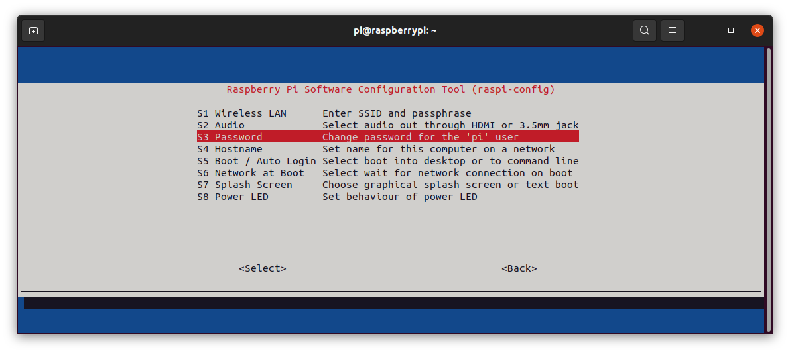

## Interface Options
enable SSH for remote access
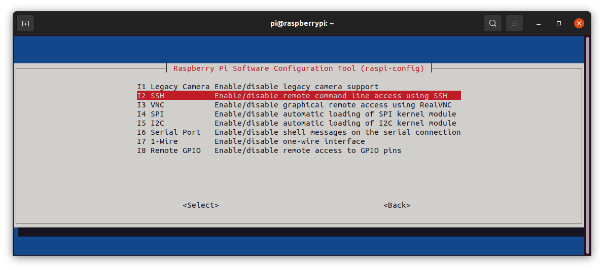

## Localization Options
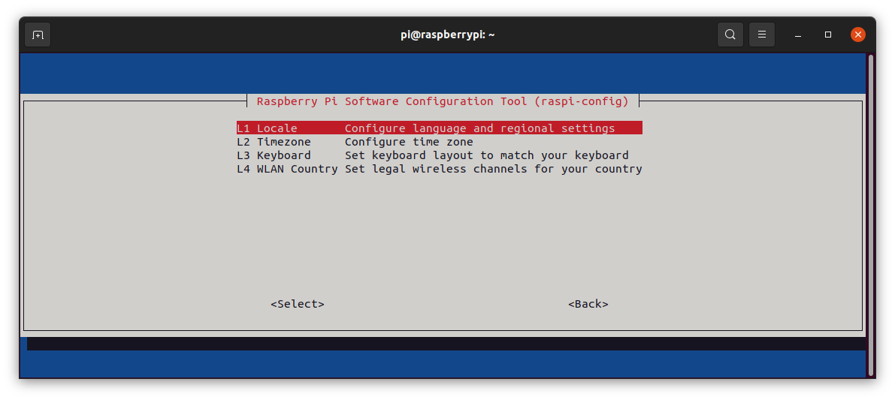
#
Under Locale, use spacebar to deselect "en_GB.UTF-8 UTF-8"

and select "en_US.UTF-8 UTF-8 
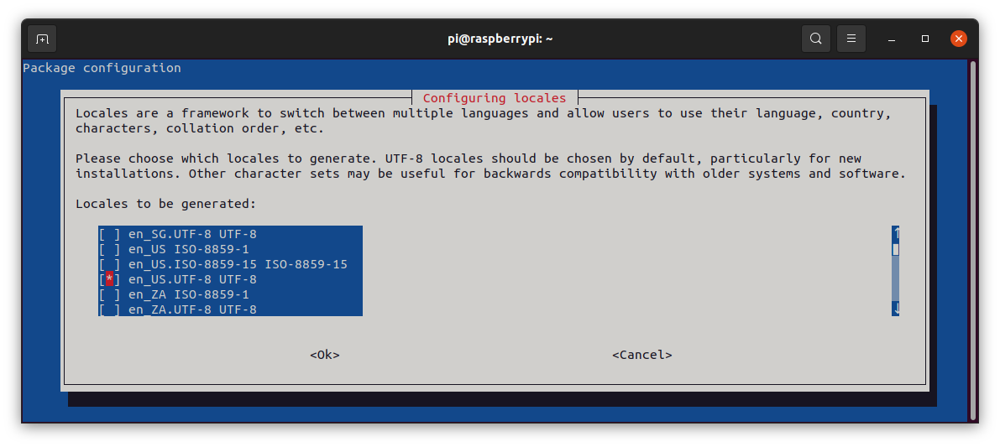
none
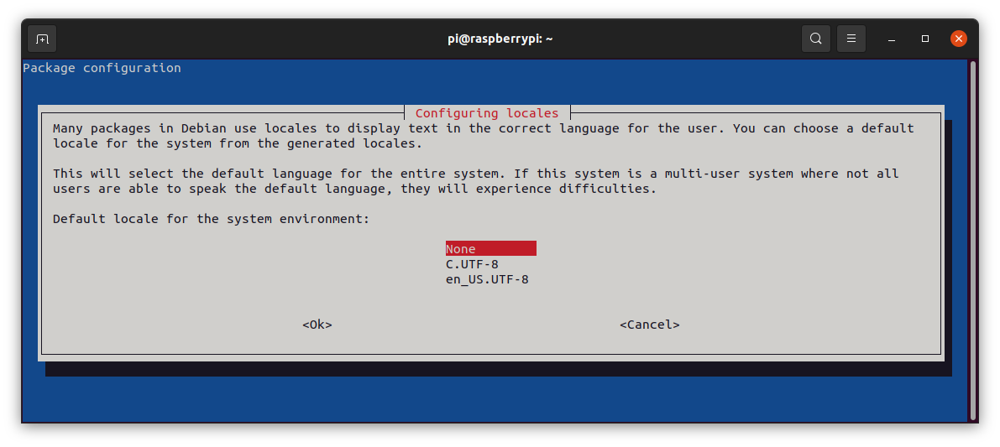
Timezone
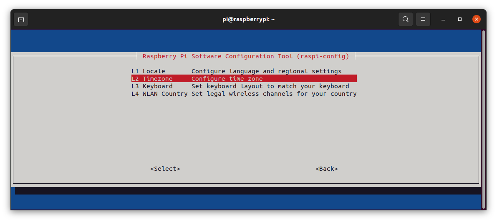
US
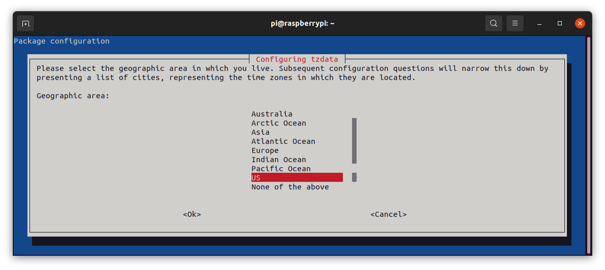
As we are favored enough to live in the The Republic of Texas

Keyboard
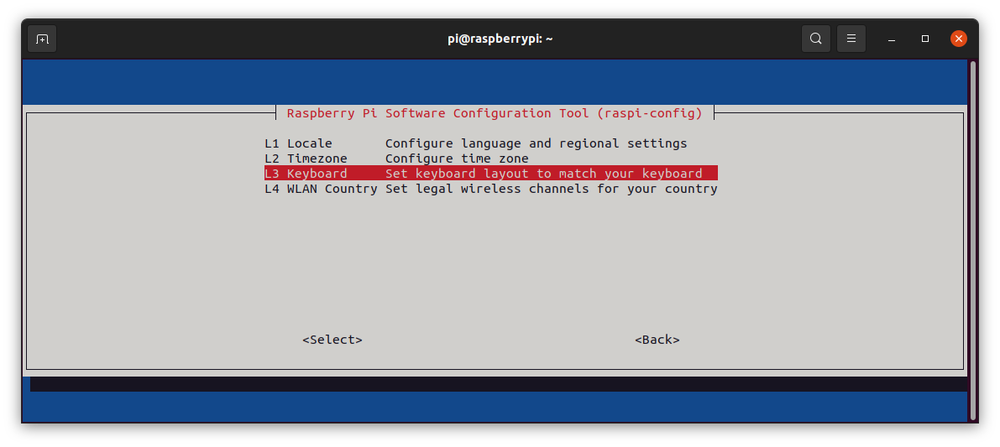
Generic 105-key PC (intl.)
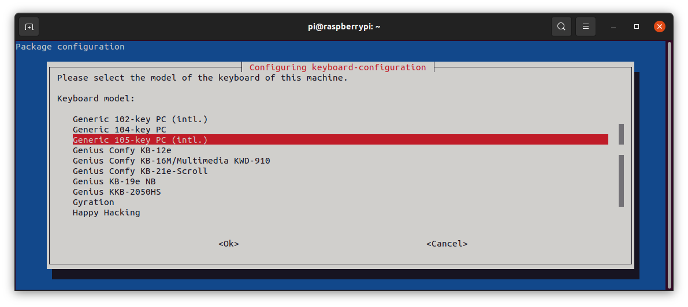
Other
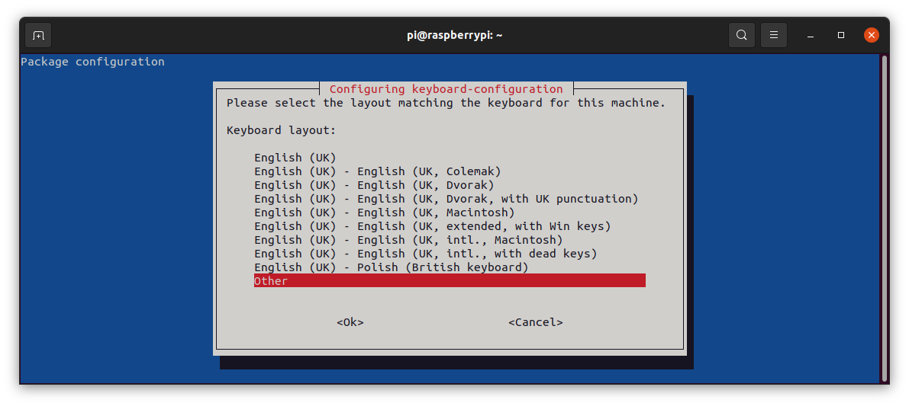
English (US)

Scroll up to English (US)
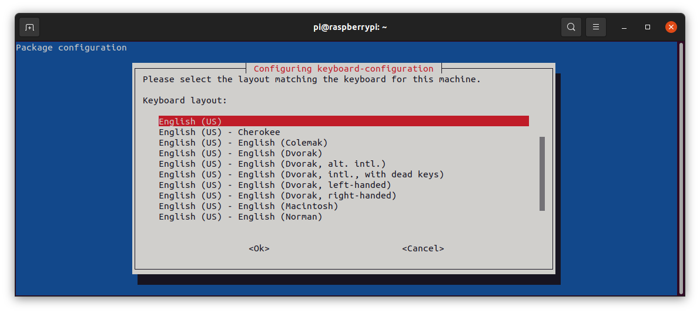
Default "Enter" the 2 screens then Finish
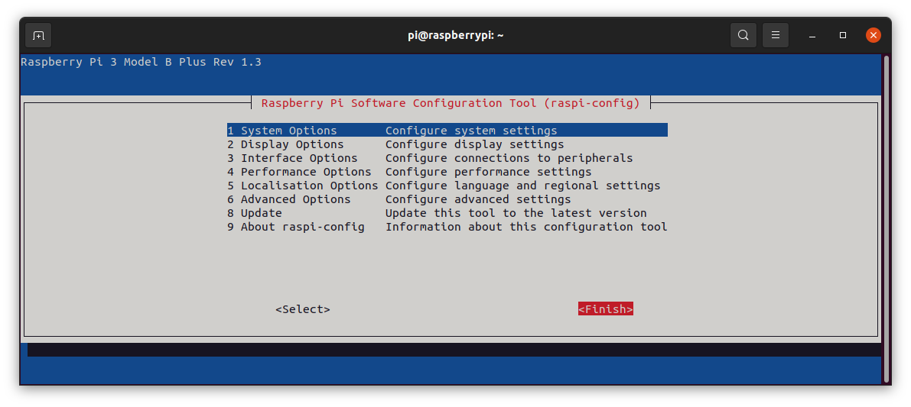
## Remote ssh login 
from PC terminal you can now remote login to your routerpi
##
    alex@xanadu_pc:~$ ssh pi@routerpi.local
    pi@routerpi:~$ 

## Update and Upgrade
##
    sudo apt update
    sudo apt upgrade